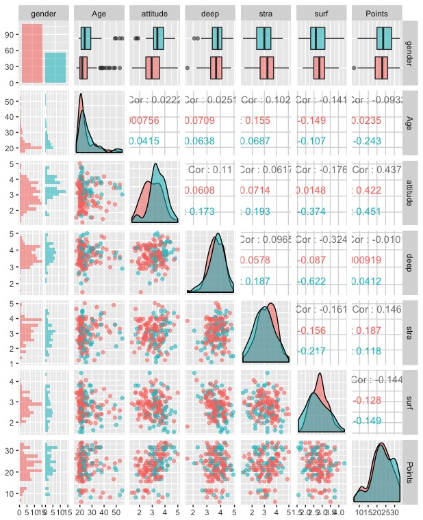

## Data Wrangling and Analysis Exercise
## 03.02.2017

*It includes the data preprocessing of an student data set and further analysis on regression modelling on certaion variables.*

We start with reading the table right after including the libraries we need. Note that packages were already installed on the locak machine:
```
library(dplyr)
library(GGally)
library(ggplot2)

data <- read.table("http://www.helsinki.fi/~kvehkala/JYTmooc/JYTOPKYS3-data.txt", sep="\t", header=TRUE)
```
*Alternative way of reading the data*:
```
data <- read.csv("http://www.helsinki.fi/~kvehkala/JYTmooc/JYTOPKYS3-data.txt")
```
Putting the data into data frame format:
```
data.frame(data)
dim(data) #dimensions of the data which happens to be 183 * 60
str(data) #structure of data with mostly integer variables and a factor 
```

### DATA WRANGLING ###

Dividing each number in the column vector:
```
data$Attitude / 10
```
Creating column 'attitude' by scaling the column "Attitude":
```
data$attitude <- data$Attitude / 10
```
Questions related to deep, surface and strategic learning:
```
deep_questions <- c("D03", "D11", "D19", "D27", "D07", "D14", "D22", "D30","D06",  "D15", "D23", "D31")
surface_questions <- c("SU02","SU10","SU18","SU26", "SU05","SU13","SU21","SU29","SU08","SU16","SU24","SU32")
strategic_questions <- c("ST01","ST09","ST17","ST25","ST04","ST12","ST20","ST28")
```

Selecting the columns related to deep learning and create column 'deep' by averaging:
```
deep_columns <- select(data, one_of(deep_questions))
data$deep <- rowMeans(deep_columns)
```
Selecting the columns related to surface learning and create column 'surf' by averaging:
```
surface_columns <- select(data, one_of(surface_questions))
data$surf <- rowMeans(surface_columns)
```

Selecting the columns related to strategic learning and create column 'stra' by averaging:
```
strategic_columns <- select(data, one_of(strategic_questions))
data$stra <- rowMeans(strategic_columns)

columns <- c("gender","Age","attitude", "deep", "stra", "surf", "Points")
learning2014 <- select(data, one_of(columns))
```

Selecting rows where points is greater than zero:
learning2014 <- filter(learning2014, Points > 0)

Writing the the dataset as csv:
```
write.csv(learning2014, file = "learning2014.csv", row.names = FALSE)
```s
Reading it again:
```
data2 <- read.csv("learning2014.csv", sep=",", header=TRUE)
```
Checking if it is in the right format:
```
str(data2)
dim(data2)
```
Yeah it is. 


### ANALYSIS ###


Reading the student 2014 file:
```
data2 <- read.csv("learning2014.csv", sep=",", header=TRUE)
```
Checking if it is in the right format:
```
str(data2) 
dim(data2)
```
Data has 116*7 dimensions as it should be, and includes 6 variables named: gender, Age, attitude, deep, stra, surf and Points. 

Exploring the variables graphically first with the pairs function. We exlude the first variable, gender because it is a factor variable. Instead we use it for the colors to categorize each variable:
```
pairs(learning2014[-1], col=learning2014$gender)
```

More advanced plot indicating the relationship between each variables could be seen in the graph after the line of code that produces it:
```
ggpairs(learning2014, mapping = aes(col=gender,  alpha = 0.3), lower = list(combo = wrap("facethist", bins = 20)))
```


Multiple regression model as it was asked that the target would be Points whereas observational variables would be our own choice from the dataset:
```
my_model <- lm(Points ~ attitude + stra + surf, data = data2)
```
Print out a summary of the model:
```
summary(my_model)
```


Summary of the model shows that attitude and points have stronger relationship with the points compared to stra and surf. As null hypothesis implies that there is no significant relationship between two observed phenomena, rejecting the null hypothesis indicates that there is a relationship between the observations. Points and attitude have seem to have a smallest p value. for the other two variables, there is no statistical significant with points variable.

Then, as it was asked in the exercise, if we reset the model with only the attitude variable that is seem to be more correlated with Points variable:
```
my_model2 <- lm(Points ~ attitude, data = data2)
```
Printing out a summary of the new model
```
summary(my_model2)
```


Drawing diagnostic plots using the plot() function. Choose the plots 1, 2 and 5 as it was asked in the exercise:
```
plot(my_model2, which=c(1, 2, 5), par(mfrow = c(2,2)))
```


The modeling involved a number of assumtions as one of the being the errors having distributed normally. qqplot shows that model goes pretty close around y = x direction which indicates that errors are distributed normally except that last part of the graph.

Leverage of observations indicated how much impact a single observation have on the model. Distribution is quite normal in the beginning, however there are few outliers towards the right hand-side of the x axis which hinders the normality.  
