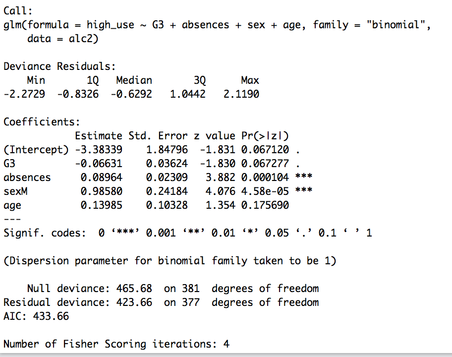

## Logistic Regression Exercise
## 10.02.2017

*It includes the data preprocessing of an student data set and further analysis on logistic regression*
We start with reading the file right after including the libraries we need as usual
```
library(dplyr)
library(GGally)
library(ggplot2)
library(boot)

data1 <- read.csv("student-mat.csv", sep = ";", header = TRUE) #reading the csv
data2 <- read.csv("student-por.csv", sep = ";", header = TRUE) #reading

data.frame(data1)
data.frame(data2)

dim(data1) #dimensions of the data which happens to be 395 * 1
str(data1) #structure of data
dim(data2) #dimensions of the data which happens to be 649 * 1
str(data2) #structure of data
```
Everything seems to be fine. Next, we will do the other requested data wrangling tasks, joining the datasets, creating alcohol variable first, then the high alcohol consumption, and removing the dublicates. Right after, we save the new file and read it again to start with the analysis.


### ANALYSIS ###
```
alc2 <- read.csv("alc.csv", sep=",", header=TRUE)
```
checking if it is in the right format:
```
str(alc2) 
dim(alc2)
```
Yep, it is 382 * 32 with other information on the variables, Also checking the column names:
```
colnames(alc2)
```

As it was asked, here are few hypotheses that I could come up with upfront: for high_use vs. failures, absences, sex, age and perhaps also the grades, I believe that high consumption is positively correlated with high number of absenses, low grades and males. Unfortunately I cannot make an hypothesis about age now, we will have to see :)
```
ggplot(alc2, aes(x = high_use, y = G3, col=sex)) + geom_boxplot()
```


The graph above shows that male high consumption is correlated with lower grades. No significant difference for females. Let's see the next:

```
ggplot(alc2, aes(x = high_use, y = absences, col=sex)) + geom_boxplot()
```


This one above shows that no significant diff between no. of absences and high use, although male comsuption is bit higher than female. Another one:
```
ggplot(alc2, aes(x = high_use, y = age, col=sex)) + geom_boxplot()
```


This one shows that mean high use age is 17 for males, whereas 16.5 for females. But it is hard to comment on it further. We will see better after the regression analysis.

Let's continue with regression modelling. First, finding the model with glm():
```
m <- glm(high_use ~ G3 + absences + sex + age, data = alc2, family = "binomial")
```
and then, printing out a summary of the model:
```
summary(m)
```


According to the summary above, absenses and sex seem to be correlated with high alcohol usage with p value being less than 0.05, where as grades and age is not significantly interesting. 

Next is to look into odds ratio and confidence intervals:
```
OR <- coef(m) %>% exp
CI <- confint(m) %>% exp
cbind(OR, CI)
```


Sex, being a male, seems to be almost twice as likely to result in higher alcohol consumption as opposed to a low level of consumption. Age also seem to be significant looking at the OR value, and absences are very close to the age's OR and is still bigger than 1, which indicated that they it is still likely to affect high alcohol consumption.

Fitting a new model with more significant variables and predicting the probability of high_use:
```
m2 <- glm(high_use ~ absences + age, data=alc2, family="binomial")
probabilities <- predict(m2, type="response")
alc2<-mutate(alc2, probability = probabilities)
alc2<-mutate(alc2, prediction = probability>0.5)
```

Tabulating the target variable versus the predictions and plotting the values:
```
table(high_use = alc2$high_use, prediction = alc2$prediction) %>% prop.table() %>% addmargins()
table(high_use=alc2$high_use, prediction=alc2$prediction)
ggplot(alc2, aes(x = probability, y = high_use, col = prediction)) + geom_point()
```


Now we can tabulate the target variable versus predictions:
```
table(high_use = alc2$high_use, prediction = alc2$prediction) %>% prop.table() %>% addmargins()
```


We can see above that there is 0.68 probability for both predicted and observed to be false and 0.02 probability for both predicted and observed to be true.

Lastly the training error and the 10 K fold mostly copying from the datacamp, as I am not yet familiar with the terms and I fail at interpreting on them:
```
loss_func <- function(class, prob) {
  n_wrong <- abs(class - prob) > 0.5
  mean(n_wrong)
}
loss_func(class = alc2$high_use, prob = alc2$probability)
```
Training error is 0.28.

```
cv <- cv.glm(data = alc2, cost = loss_func, glmfit = m2, K = 10)
cv$delta[1]
```
aaand, test error is 0.28 as well :)

